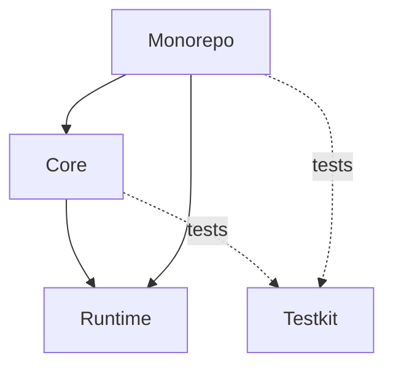
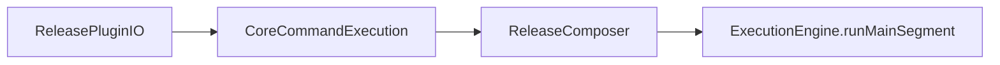

# Project architecture (contributors)

This page maps **sbt modules**, **runtime layers**, and **internal types** so you can navigate the codebase without duplicating the user-facing guides in [Core concepts](core/concepts.md) and [Monorepo concepts](monorepo/concepts.md).

## Module layout

sbt modules under `modules/`:

| Module     | Role |
| ---------- | ---- |
| **runtime** | Shared engine: `ExecutionEngine`, `ProcessStep`, `LifecycleCompiler`, VCS, version model, command helpers (`ReleaseCommandCompilation`, `ReleaseCommandRunner`). No dependency on `core` or `monorepo`. |
| **core**    | Single-project plugin (`ReleasePluginIO`), `ReleaseContext`, default steps, core lifecycle. Depends on **runtime** and **testkit** (tests) and packages the shared/runtime support classes needed by downstream consumers. |
| **monorepo** | Multi-project plugin (`MonorepoReleasePlugin`), `MonorepoContext`, change detection, per-project steps. Depends on **core**, **runtime**, and **testkit** (tests). |
| **testkit** | Test fixtures and assertions. Used by core/monorepo tests. |

At the code/build level, `runtime` owns the shared-key/defaults implementation.
`ReleasePluginIO` is the public grouped-key surface for shared `releaseIO*` settings, and
`MonorepoReleasePlugin` requires `ReleasePluginIO`, so monorepo-only installs inherit both
`releaseIOMonorepo*` and the shared/core `releaseIO*` layer transitively.

Dashed edges are test-only dependencies.

## Command and execution flow

Both plugins block the sbt command thread, prepare a plan, compile hooks/policies into steps, then
run them with cats-effect `IO` (`unsafeRunSync` at the command boundary). Shared engine pieces
live in **runtime**; plugin-specific wiring lives in **core** or **monorepo**.

There is no public shared AutoPlugin. `ReleasePluginIO` owns the public shared/core `releaseIO*`
import surface, and `MonorepoReleasePlugin` requires it while keeping its own
`releaseIOMonorepo*` contract.

### Core (single-project)

- Registration and core-specific keys: [`ReleasePluginIO`](../modules/core/src/main/scala/io/release/ReleasePluginIO.scala)
- CLI, resource hooks, merge/compile: [`CoreCommandExecution`](../modules/core/src/main/scala/io/release/core/internal/CoreCommandExecution.scala) (uses [`ReleaseCommandCompilation`](../modules/runtime/src/main/scala/io/release/runtime/command/ReleaseCommandCompilation.scala))
- Wrap steps as `PreparedStep`, cross-build: [`ReleaseComposer`](../modules/core/src/main/scala/io/release/ReleaseComposer.scala)
- Validate all, then execute all: [`ExecutionEngine`](../modules/runtime/src/main/scala/io/release/runtime/engine/ExecutionEngine.scala)

### Monorepo

- Registration: [`MonorepoReleasePlugin`](../modules/monorepo/src/main/scala/io/release/monorepo/MonorepoReleasePlugin.scala)
- CLI, planning, merge/compile: [`MonorepoCommandExecution`](../modules/monorepo/src/main/scala/io/release/monorepo/internal/MonorepoCommandExecution.scala)
- Selection boundary (default built-in flow): setup segment uses sequential validate-then-execute; main segment uses validate-all-then-execute (same engine mode as core main). If no selection-boundary step is present, the whole process falls back to sequential validate-then-execute: [`MonorepoComposer`](../modules/monorepo/src/main/scala/io/release/monorepo/internal/MonorepoComposer.scala)

## Glossary

| Name | Meaning |
| ---- | ------- |
| `ProcessStep` | Internal ADT: [`Single`](../modules/runtime/src/main/scala/io/release/runtime/engine/ProcessStep.scala) (one context) or `PerItem` (context + item, e.g. project). Policies and hooks compile to these via [`LifecycleCompiler`](../modules/runtime/src/main/scala/io/release/runtime/engine/LifecycleCompiler.scala). |
| `ExecutionEngine.PreparedStep` | Thin runtime wrapper (`validate` / `execute` as `C => IO[C]`) used only inside [`ExecutionEngine`](../modules/runtime/src/main/scala/io/release/runtime/engine/ExecutionEngine.scala). Composers build these from `ProcessStep`. |
| Core `Step` | Type alias for `ProcessStep.Single[ReleaseContext]` (see core step aliases). |
| Monorepo `AnyStep` | `ProcessStep[MonorepoContext, ProjectReleaseInfo]` (single or per-project). |
| `ReleaseContext` | Core threaded state (versions, VCS, sbt `State`, flags). |
| `MonorepoContext` | Global monorepo state plus per-project info and selection. |

For validate vs execute semantics and `releaseIO check` / `releaseIOMonorepo check`, see [Core concepts](core/concepts.md) and [Monorepo concepts](monorepo/concepts.md).

## Related reading

- Repository layout and key source files: [../CLAUDE.md](../CLAUDE.md) (maintainer cheat sheet)
- Core user docs: [core/README.md](core/README.md)
- Monorepo user docs: [monorepo/README.md](monorepo/README.md)
- Build and contribution expectations: [CONTRIBUTING.md](CONTRIBUTING.md)
